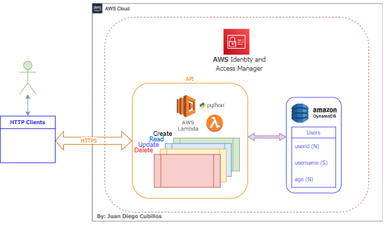
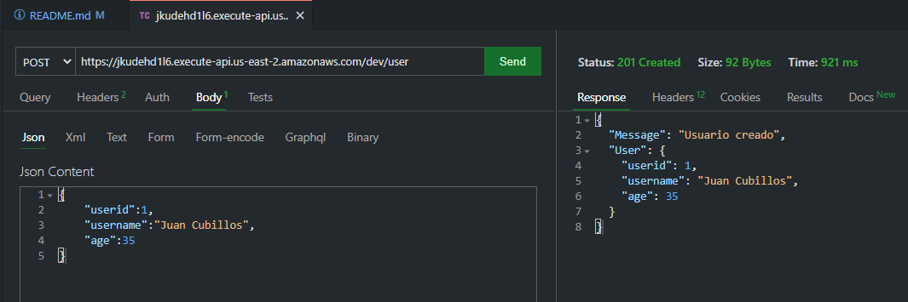
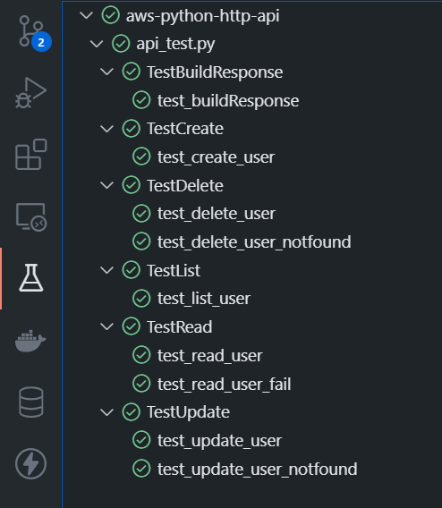

# API AWS, usando Lambda Functions programadas en Python y usando DynamoDB(AWS)

## By: Juan Diego Cubillos Maestre
### [Github](https://github.com/juandinetUPC)
### [LinkedIn](https://linkedin.com/in/juan-diego-cubillos-630654195)

## Diseño de la Solución




## En un entorno virtual usando Python3 , pip y la siguiente lista de dependencias (requirements.txt)
para exportar los requerimientos de la aplicación(sejecuta al final):
```pip freeze > requirements.txt```
- boto3==1.23.9
- botocore==1.26.10
- certifi==2022.5.18.1
- charset-normalizer==2.0.12
- idna==3.3
- jmespath==1.0.0
- python-dateutil==2.8.2
- requests==2.27.1
- s3transfer==0.5.2
- six==1.16.0
- urllib3==1.26.9

Adicionalmente se debe instalar AWS CLI (https://aws.amazon.com/cli/)
y generar una llave de acceso AWS (https://docs.aws.amazon.com/cli/latest/userguide/cli-chap-configure.html) para poder usar el comando aws.

Instalar serverless

```pip install serverless```


Si no está instalado, instalamos virtualenv

```powershell
pip install virtualenv
```

Para crear un ambiente virtual digitamos el siguiente comando:

```powershell
virtualenv -p python3 env
```

para poner a funcionar el entorno virtual, se debe ejecutar:

```powershell
.\env\Scripts\activate
```

Una vez iniciado el entorno virtual, se ejecuta el siguiente comando:

```powershell
pip install -r .\requirements.txt
```

Para correr la solución se ejecuta el siguiente comando:

```powershell
serverless deploy --verbose
```

Para correr los test unitarios se ejecuta el siguiente comando:

```powershell
python .\api_test.py
```



